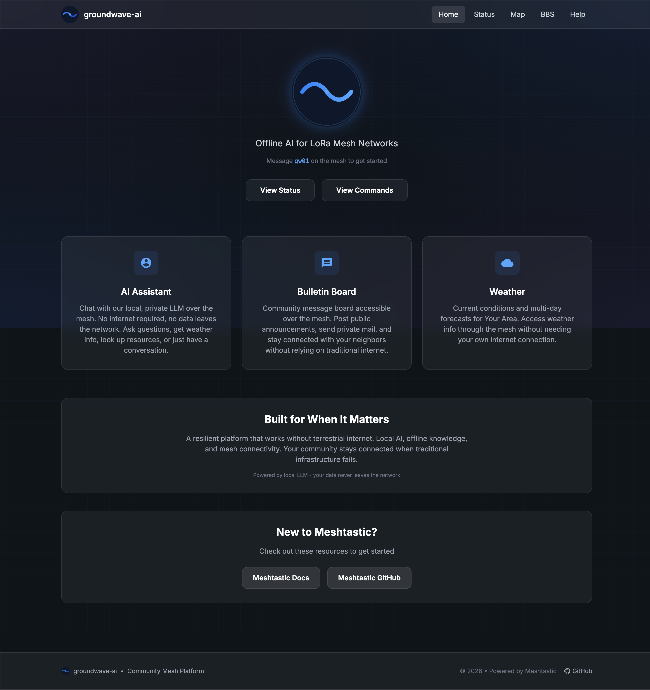
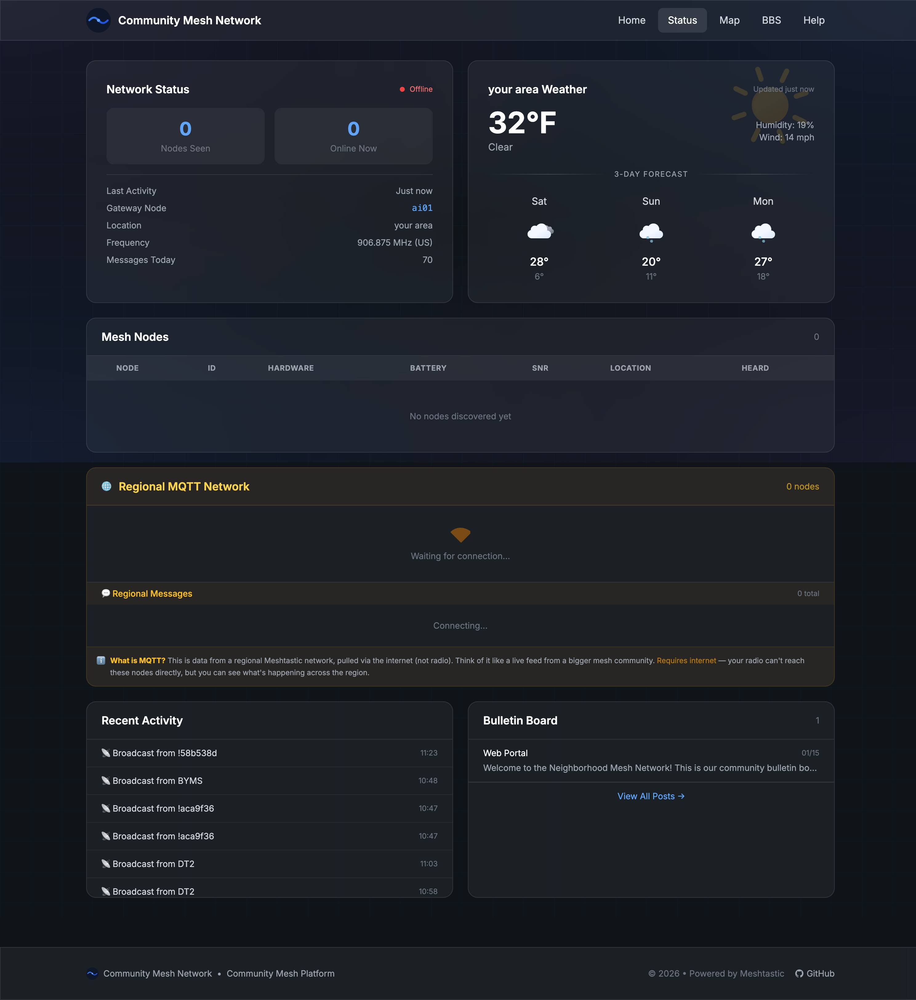
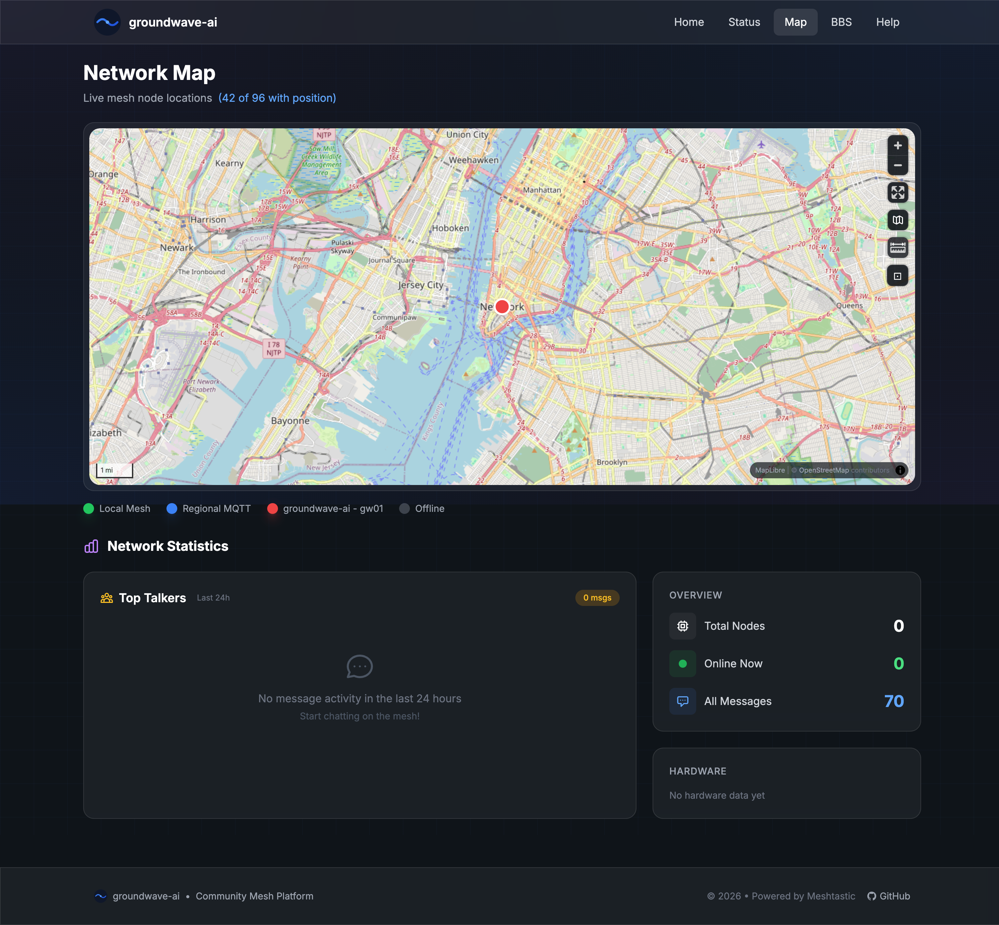

# groundwave-ai

**Offline AI Assistant & BBS for LoRa Mesh Networks**

[](https://opensource.org/licenses/MIT)

> *No cloud. No internet. Just radio.*

groundwave-ai is a self-hosted community platform for LoRa mesh networks. It provides an AI assistant powered by local or cloud LLMs, a bulletin board system, weather updates, and a web portal — all capable of running entirely offline.



---

## Protocol Support

| Protocol | Status | Notes |
|----------|--------|-------|
| **[MeshCore](https://meshcore.net/)** | Coming Soon | Recommended for new deployments |
| **[Meshtastic](https://meshtastic.org/)** | Supported | Legacy support |

groundwave-ai is built with a **protocol abstraction layer**, making it easy to support multiple mesh protocols. We're prioritizing MeshCore support for its improved architecture and active development.

**Why MeshCore?**
- Cleaner protocol design
- Better scalability for large networks
- More active development community
- Purpose-built for mesh communication

If you're starting fresh, consider waiting for MeshCore support or running both protocols during the transition.

---

## Features

### AI Assistant
- **Flexible LLM Support** — Works with ANY OpenAI-compatible API:
  - **Local:** [LM Studio](https://lmstudio.ai/), [Ollama](https://ollama.ai/), [llama.cpp](https://github.com/ggerganov/llama.cpp), [vLLM](https://github.com/vllm-project/vllm)
  - **Cloud:** OpenAI, Anthropic, Groq, Together.ai, OpenRouter, or any OpenAI-compatible endpoint
- **Offline Wikipedia** — Optional [Kiwix](https://www.kiwix.org/) integration for factual knowledge
- **Smart Classifier** — Only queries knowledge base when needed
- **Customizable Personality** — Configure prompts and local knowledge

### Bulletin Board System
- Public message boards (General, Urgent, Info, Trade)
- Private mail between nodes
- Message expiry and moderation
- Customizable board categories

### Weather
- Current conditions and forecasts
- [Open-Meteo](https://open-meteo.com/) API (free, no key required)
- Works offline with caching
- Satellite weather feed integration coming soon

### Web Portal
- **Live Dashboard** — Real-time node status, messages, weather
- **Network Status** — See all nodes, signal strength, battery levels
- **Interactive Map** — View node locations with distance measurement
- **Send Messages** — Interact with the mesh from any browser
- **Admin Panel** — Configure everything from your browser
- **Mobile Friendly** — Responsive design for all devices

<details>
<summary>View Screenshots</summary>

**Status Page**


**Network Map**


</details>

### Regional MQTT (Optional)
- Connect to regional Meshtastic MQTT servers
- See nodes from the wider network
- Clearly separated from local mesh data

---

## Quick Start

### Prerequisites

- Python 3.10+
- A Meshtastic device (T-Deck, T-Beam, Heltec, etc.)
- An LLM endpoint (choose one):
  - **Local (offline):** [LM Studio](https://lmstudio.ai/), [Ollama](https://ollama.ai/), or any local server
  - **Cloud:** OpenAI API key, or any OpenAI-compatible service

### Installation

```bash
# Clone the repository
git clone https://github.com/yourusername/groundwave-ai.git
cd groundwave-ai

# Create virtual environment
python -m venv venv
source venv/bin/activate  # On Windows: venv\Scripts\activate

# Install dependencies
pip install -r requirements.txt

# Copy example configs
cp env.example .env
cp config.yaml.example config.yaml

# Edit .env with your settings
nano .env  # or use your preferred editor
```

### Configuration

1. **Edit `.env`** — Set your serial port, community name, LLM URL, etc.
2. **Edit `config.yaml`** — Customize prompts, BBS boards, and features
3. **Add your logo** — Replace `static/logo_large.png` and `static/logo_small.png`

### Finding Your Serial Port

```bash
# macOS
ls /dev/cu.*

# Linux
ls /dev/ttyUSB* /dev/ttyACM*

# Windows
# Check Device Manager > Ports (COM & LPT)
```

### Running

```bash
# Start the platform
python run.py

# Or use the restart script
./restart-all.sh
```

Open http://localhost:8000 in your browser.

---

## Admin Panel

Access the admin panel at http://localhost:8000/admin to configure your node without editing config files.

### Features

- **Serial Port Detection** — Auto-detect USB modems with one click
- **Community Branding** — Set network name, location, bot identity
- **Mesh Settings** — Protocol, connection type, chunk sizes
- **LLM Configuration** — Provider, URL, model selection
- **Weather Settings** — Location search by city/zip, units
- **Regional MQTT** — Connect to regional mesh networks
- **Kiwix Setup** — Configure offline Wikipedia

### Security

The admin panel is protected by:

1. **Password** — Set `ADMIN_PASSWORD` in `.env` (default: `changeme`)
2. **IP Restriction** — Control who can access admin:

| Setting | Access |
|---------|--------|
| `localhost` | Only from the machine running groundwave |
| `local` | LAN IPs (192.168.x.x, 10.x.x.x, etc.) |
| `all` | Anyone (use with caution!) |

Set `ADMIN_ACCESS` in `.env` or `admin_access` in `config.yaml`.

### Serial Port Auto-Detection

In the Mesh Connection section, click **Detect** to scan for USB devices:

1. Plug in your Meshtastic device
2. Go to Admin > Mesh Connection
3. Click the **Detect** button
4. Select your device from the list
5. Click **Save**

No more hunting for `/dev/cu.usbmodem...` paths!

---

## Mesh Commands

Users can interact with the bot by sending these commands over the mesh:

| Command | Description |
|---------|-------------|
| `!help` | Show available commands |
| `!ping` | Test connectivity |
| `!wx` or `!weather` | Current weather |
| `!forecast` | Multi-day forecast |
| `!nodes` | List active mesh nodes |
| `!ai <question>` | Ask the AI assistant |
| `!bbs` | View bulletin board |
| `!post <message>` | Post to bulletin board |
| `!mail` | Check private messages |
| `!clear` | Clear conversation history |

Or just send a direct message to chat naturally with the AI.

---

## Configuration Reference

### Environment Variables (`.env`)

| Variable | Description | Default |
|----------|-------------|---------|
| `COMMUNITY_NAME` | Your network name | "My Mesh Network" |
| `BOT_SHORT_NAME` | 4-char bot name on mesh | "ai01" |
| `MESH_SERIAL_PORT` | Device serial port | — |
| `LMSTUDIO_URL` | LLM API URL | http://localhost:1234/v1/chat/completions |
| `ADMIN_PASSWORD` | Web admin password | changeme |

See `env.example` for all options.

### Config File (`config.yaml`)

| Section | Description |
|---------|-------------|
| `mesh` | Message chunking, delays |
| `llm` | System prompt, local knowledge |
| `bbs` | Board names, message limits |
| `weather` | Units, cache settings |
| `mqtt` | Regional network settings |
| `kiwix` | Offline Wikipedia settings |

See `config.yaml.example` for all options.

---

## Optional: Offline Wikipedia (Kiwix)

For factual questions, groundwave-ai can query an offline Wikipedia:

1. Download [Kiwix tools](https://wiki.kiwix.org/wiki/Kiwix-serve)
2. Download a ZIM file (e.g., [Simple English Wikipedia](https://wiki.kiwix.org/wiki/Content_in_all_languages))
3. Run Kiwix server:
   ```bash
   kiwix-serve --port 8080 wikipedia_en_simple.zim
   ```
4. Enable in `.env`:
   ```
   KIWIX_ENABLED=true
   KIWIX_URL=http://localhost:8080
   ```

---

## Architecture

```
groundwave-ai/
├── app/
│   ├── interfaces/       # Protocol abstraction layer
│   │   ├── base.py       # Abstract interface (MeshInterface)
│   │   ├── meshtastic_interface.py
│   │   └── meshcore_interface.py
│   ├── services/         # AI, Weather, BBS, MQTT
│   └── web/              # FastAPI routes, templates
├── data/                 # SQLite database, Kiwix files
├── static/               # Logos, CSS, icons
└── config.yaml           # Your configuration
```

### Protocol Abstraction Layer

The core of groundwave-ai is protocol-agnostic. All mesh communication goes through a unified `MeshInterface` abstract class:

```python
class MeshInterface(ABC):
    async def connect(self) -> bool
    async def disconnect(self) -> None
    async def send_message(self, text, destination, channel) -> bool
    def get_node(self, node_id) -> MeshNode
    def get_all_nodes(self) -> list[MeshNode]
```

This means:
- **Switching protocols** requires zero changes to AI, BBS, or web code
- **Running both protocols** simultaneously is architecturally possible
- **Adding new protocols** only requires implementing the interface

Current implementations:
- `MeshtasticInterface` — Full support via meshtastic-python
- `MeshCoreInterface` — In development

---

## Contributing

Contributions are welcome! Please:

1. Fork the repository
2. Create a feature branch (`git checkout -b feature/amazing-feature`)
3. Commit your changes (`git commit -m 'Add amazing feature'`)
4. Push to the branch (`git push origin feature/amazing-feature`)
5. Open a Pull Request

---

## License

MIT License — see [LICENSE](LICENSE) for details.

---

## Acknowledgments

- [Meshtastic](https://meshtastic.org/) — LoRa mesh firmware
- [LM Studio](https://lmstudio.ai/) — Local LLM hosting
- [Open-Meteo](https://open-meteo.com/) — Free weather API
- [Kiwix](https://www.kiwix.org/) — Offline Wikipedia access

---

**Built for communities. Runs without internet. Powered by radio waves.**
